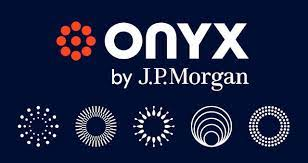

# Wealth Management FinTech Case Study

## JP Morgan Wealth Management - Dylan Jurgensen
### JP Morgan - An Evolving Giant in FinTech
#### Introduction

J.P. Morgan & Co. is a financial institution who specializes in investment banking, asset management, and private banking. They are a subsidiary of JPMorgan Chase & Co., who’s long standing history dates to 1799 as the Manhattan Company, starting as one of the very first financial institutions after the United States inception. John Pierpont Morgan rebranded the organization as Morgan & Co. in 1871, and John Thompson started Chase National Bank in 1877. The company has gone over many name changes and mergers since then, but is a household name in the world of finance today. This case study will dive into how J.P. Morgan began in FinTech, and how they continue to develop new tools and platforms in order to keep pace with the ever-changing field of financial technology.

##### Business Activities & Future in FinTech

J.P. Morgan uses many types of technology to conduct their business. Whether it be with their online banking tools and convenience services, automated advisors who handle clients’ brokerage accounts, or their three-year-old blockchain platform Onyx, this firm is using technology as an imperative resource in paving its way into the future of FinTech. We can consider this a FinTech company because J.P. Morgan is currently using many assets to develop software in order to help their clients manage their finances more efficiently on their online platforms. J.P. Morgan has maintained the position as a global leader in digital payments innovation by being recognized with a No. 1 overall ranking for digital capabilities through its global cash management platform, J.P. Morgan Access, in the 2021 Coalition Greenwich Digital Banking Benchmark study.

 While Onyx is very young, it is going to be a key component of J.P. Morgan as we head deeper into the 21st century. Onyx has the capability to be enchance the effiency of larger transactions that need to travel across the globe. For example, a typical international wire can take at least five business days to fully complete and clear the funds. With Onyx, these types of transactions can be completed in real time. This gives every day banking clients a way better experience. If this type of transaction was done by a a large corporation trying to move funds to a different country, it can increase the receiving comapny's liquidity of its assets instantly, as well as keeping an automated documented record for the sending company without them having to lift a finger. Onyx does come with its challenges however. The system is still so new and hasn't picked up as much steam so far, but that will come as FinTech continues to make strides. 
  
##### Competitors and Landscape

J.P. Morgan is at the forefront of technology in the financial sector because of their massive capital and market space. Their biggest competitors in the wealth management field are Merrill Lynch, Morgan Stanley, Wells Fargo, and Charles Schwab, just to name a few. Over the last several years, the competition has ramped up due to new technology in wealth management constantly being rolled out. Wells Fargo has focused on technological advancements to enhance both operational efficiency and customer engagement. Their initiatives include the utilization of blockchain for cross-border payments through Corda and the implementation of AI-driven virtual assistants for improved customer service. Merrill Lynch, Morgan Stanley, and Charles Schwab have integrated technology, particularly robo-advisory tools, to enhance their wealth management and advisory services, however they do not have a blockchain platform like Onyx or Corda. Corda faces similar challenges to Onyx as it has not been widely used by clients yet, as many every day people who use online banking platforms do not deem it necessary to advance to that type of technology at this time.

##### Conclusion & Recommendations

 Since technology has become a part of human beings' every day life (not just in wealth management), there has constantly been new tools and applications being used to make our lives easier. J.P. Morgan has adapted accorindingly to that truth by continously creating innovative FinTech systems to provide gold standard financial services to their millions of clients worldwide. As an employee of the company, my recommendation to J.P. Morgan would be to expand the workforce in the Onyx department as roles are very limited at the moment, this is because of the service being so new that they are trying to put quality and experiences personnel in these positions, but that will come with time. However, they will continue to develop the Onyx department and be ready to take the next step into the future of financial technology.

##### Citations

https://www.jpmorganchase.com/about/our-history

https://www.jpmorgan.com/onyx/about.htm

https://www.jpmorgan.com/onyx/coin-system.htm

https://corda.net/modal/wells-fargo/

https://www.jpmorgan.com/insights/payments/banking-as-a-service/access-platform-scores-digital-innovation-study

https://www.morganstanley.com/what-we-do/wealth-management/financial-management-tools
